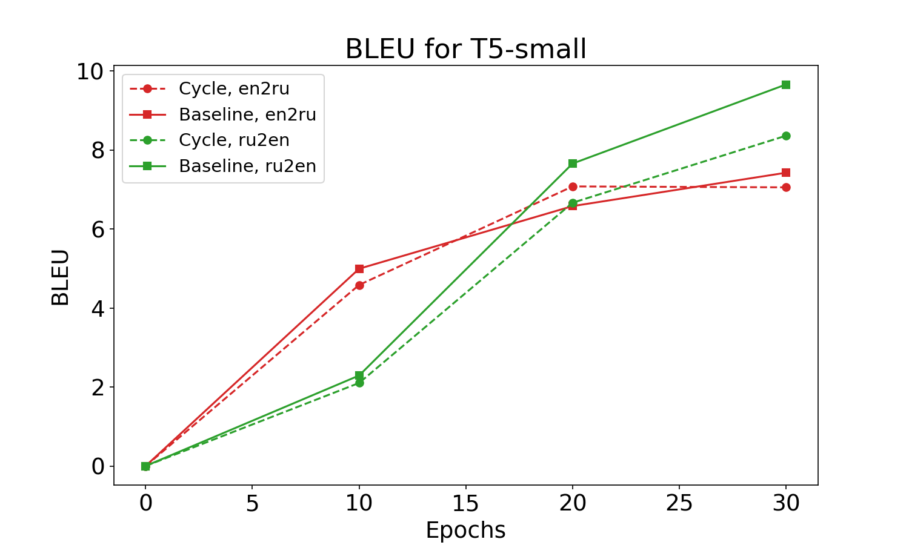

# CycleTranslate

Neural Machine Translation with cycle-consistency.

Final project on Skoltech DL-2023 course.

## Problem definition 

Traditional methods of Neural Machine Translation (NMT) require a big corpus of paired texts.
However, in our information age, we have a lot of unstructured unpaired data in the internet.
So, can we employ this unlabeled data to train an NMT language model? Or use the data at your disposal more efficiently?

Observation: if you translate from English to Russian, and then back, you must get the same thing.
So, having two translation models, we can take unpaired data, translate it with one model and force other to translate it back.

We can also apply the same trick, training two translation models in parallel on paired data, trying to elicit more signal from what we have.

There are many ways to delevop from this idea, so to be directed, we fomulate several more concrete questions:
- Can we benefit from additional unlabeled data using cycle consistency?
- Can we benefit from enforcing cycle consistency in low-data regime?
- How do the results depend on the model size?

## Main results

### Low-data regime
Original English-Russian dataset, taken from [here](http://www.manythings.org/anki/) contains about 450k of paired sentences.
To emulate low-data regime, we subsampled 10k examples and dubbed them `low_resource_train`.

The first experiment was to train four t5-base models on `low_resource_train` for 10 epochs.
First pair of models was trained using the classic CrossEntropy loss, while two other models used combination of CrossEntropy and proposed Cyclic Loss.

| Experiment name | BLEU for en2ru model | BLEU for ru2en model |
|---|---|---|
| T5-base, CrossEntropy loss, 10 epochs | 4.7844 | 4.3415 |
| T5-base, CrossEntropy + Cyclic Loss, 10 epochs | **6.1359** | **5.7527** |

As you can see, on low number of epochs, proposed method of training yields better BLEU scores.

The next experiment was to train four t5-base models on `low_resource_train`, but this time do the training for 30 epochs instead of 10 epochs.  Again, first two models were to be trained using the classic CrossEntropy loss, while two other models employed our proposed Cyclic Loss.

| Experiment name | BLEU for en2ru model | BLEU for ru2en model |
|---|---|---|
| T5-base, CrossEntropy loss, 30 epochs | **14.7513** | **18.7511** |
| T5-base, CrossEntropy + Cyclic Loss, 30 epochs | 13.7197 | 17.6676 |

Surprisingly, on higher amount of epochs, our models yield a tad lower scores.

### Smaller models

Here we use the same setup as before, expect the model now is t5-small (`cointegrated/rut5-small`, to be exact).



On this plot we can see, that cycle consistency only helps once, on 20 epochs for English to Russian model.
We hypothesize, that small model is less robust to noisy training signals. 

### Unpaired data
The third experiment was to train six t5-base models, using different amount of data. First four models use only the small subset of labeled data that was used in previous experiments and CrossEntropy Loss, while the last two models use Cyclic Loss and are being trained in the following manner:
- Train for 10 (or 30) epochs on the `low_resource_train` (init stage)
- Train for 1 epoch on a big set (~300k sentences) of unlabeled data (pretrain stage)
- Train for 10 epochs on the `low_resource_train` (finetune stage)

| Experiment name | BLEU for en2ru model | BLEU for ru2en model |
|---|---|---|
| T5-base, CrossEntropy loss, 10 epochs | 4.7844 | 4.3415 |
| T5-base, CrossEntropy loss, 30 epochs | 14.7513 | 18.7511 |
| T5-base, CrossEntropy + Cyclic Loss, multistage, 10 + 1 + 10 epochs | 6.7953 | 7.2948 |
| T5-base, CrossEntropy + Cyclic Loss, multistage, 30 + 1 + 10 epochs | 15.1079 | 20.2587 |

We get improvement over training for less number of epochs. 
But if we compare 30 epoch baseline against 10-1-10 multistage, the former wins convicingly, while the wall-clock time of training is comparable.

### Summary

In conclusion, cycle consistency constraint can help when training larger models for a smaller amount of epochs.
In other cases it does not provide any benefit, or even worsens the score.

## Getting data

```
cd data
wget http://www.manythings.org/anki/rus-eng.zip
unzip rus-eng.zip

python make_split.py
```

## Setup

[Install](https://mamba.readthedocs.io/en/latest/installation.html) `micromamba`. For Linux users:
```
curl micro.mamba.pm/install.sh | bash
```
Restart the terminal.

Create and activate environment with
```
micromamba create -f env.yml
micromamba activate cyc
```

Configure PYTHOPATH:
```
export PROJECT_DIR=path/to/CycleTranslate
micromamba env config vars set PYTHONPATH=${PROJECT_DIR}:

micromamba deactivate
micromamba activate
```

Then, to reproduce, e.g. training of t5-small, one can run
```
CUDA_VISIBLE_DEVICES=0 python two_model_cyc/train.py --batch_size 512 --model-name cointegrated/t5-small --run-name small_model_small_train
```

## Team:
- Seleznyov Mikhail 
   - experiment design
   - implementing the baseline model
   - running experiments
   - tuning README and presentation
- Sushko Nikita 
   - idea of the project
   - implementing helper and utility scripts
   - running experiments
   - writing README
- Kovaleva Maria 
   - implementing the cyclic loss model
   - preparing presentation
   - existing paper research
   - running experiments
